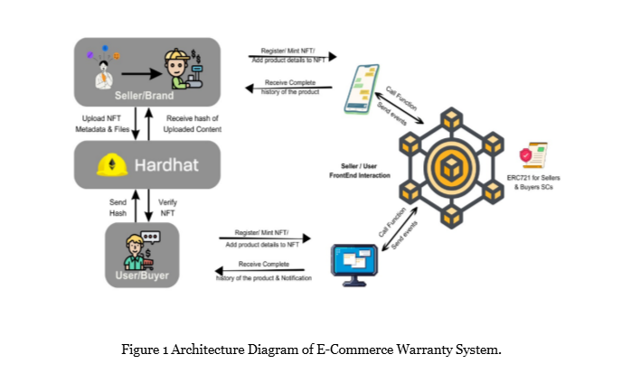

# Project Flowchart

## 📝 Description
The objective of our project is to replace the Physical/Digital warranty or ownership card by a blockchain based decaying warranty via NFTs which will ensure Transparency, Authenticity, and more Security. The method facilitates conversion of physical product warranty cards into decaying NFTs using ERC721
This include:
- Allow brands and retailers to introduce an NFT which accompanies each of their products
- Enable customers to use the digital NFT to verify the authenticity and ownership of their product and transfer ownership upon resale, if valid and required,
 - Allow brand/retailer to integrate the digital NFT to its warranty program, allowing owners to track repairs and replacements to the original item.

## 📖 Product registration
When a product is manufactured, it is registered on the e-Commerce warranty system.
The registration process include
- creating a digital identity for the product
- storing information such as the product’s make, model, serial number, and other relevant details.
We should develop a web-based user interface for manufacturers to register their products to the system by using product registration form, product details input, and product image upload.


## ✨ NFT Minting

Once registered, the NFT representing the product certificate is generated and attached to the product’s digital identification. 
The NFT contains information such as the name of the registration date, the warranty expiration date, and the unique serial number used to verify the authenticity of the product. 
NFTs are minted and stored and transferred in a tamper-proof and decentralized manner on the Ethereum blockchain network.

## ✨ Product sale and Warranty Verification

Once registered, the NFT representing the product certificate is generated and attached to the product’s digital identification. 
The NFT contains information such as the name of the registration date, the warranty expiration date, and the unique serial number used to verify the authenticity of the product. 
NFTs are minted and stored and transferred in a tamper-proof and decentralized manner on the Ethereum blockchain network.

## ✨ Warranty claims

The consumer’s warranty claim is transferred to the manufacturer through the e-Commerce warranty system. The manufacturer may use product NFT to validate the product and process warranty claims accordingly.
A web-based user interface has been developed for manufacturers to handle warranty claims and manage their products in the system. 
The proposed system is implemented on a blockchain network, which provides tamper-proof storage of the product’s digital identity and NFTs as shown in figure 2. 
This ensures that the product’s authenticity and ownership can be verified and tracked throughout its lifetime. In order to evaluate the proposed system, a prototype of the system is implemented and tested with a sample set of products. 
The metrics used for evaluation are authentication accuracy, the percentage of products that are correctly identified as authentic or counterfeit.


The Seller can mint the Warranty NFT and generate warranty for the customers. This happens by calling a function from the deployed contract which takes care of minting.


The customer can claim the warranty by clicking the ‘Claim’ button in the expanded view of the NFT. After a successful claim, the claim timeline will be updated with the new claim data. 
This also happens by calling a dedicated function which handles the claim process and returns required data. When a customer buys a product and is issued a Warranty NFT, he/she is awarded some points (Purchase Points) 
which is set by the seller at the time of deployment. If at the time of issuing warranty, the customer has points more than or equal to the Threshold Points, then he/she can use points and get an extra 100 days (Extra Warranty) of warranty period. 
After doing so, some points (Redeem Points) are deducted from the customer’s total points. Note that in current implementation Purchase Points, Threshold Points, Extra Warranty and Redeem Points are set by the seller at the time of contract deployment.


## 🧰 Get Started

To get this project up and running in your development environment, follow these step-by-step
instructions.

### 📋 Prerequisites

In order to install and run this project locally, you would need to have the following installed on
your local machine.

- [Node.js](https://nodejs.org/en/)
- [NPM](https://www.npmjs.com/get-npm)
- [Git](https://git-scm.com/downloads)

### ⚙️ Installation and Run Locally

**Step 0:**

Note :bangbang: the application uses EmailJS in order to send emails using client-side, therefore,
you need to create EmailJS account [here](https://emailjs.com/) and sets the
`VITE_EMAILJS_SERVICE_ID`, `VITE_EMAILJS_TEMPLATE_ID`, and `VITE_EMAIL_JS_ACCESS_TOKEN` environment
variables in `.env` file.

**Step 1:**

Download or clone this repo by using the link below:

```bash
git clone https://github.com/ladunjexa/reactjs18-3d-portfolio.git
```

**Step 2:**

Execute the following command in the root directory of the downloaded repo in order to install
dependencies:

```bash
npm install
```

**Step 3:**

Execute the following command in order to run the development server locally:

```bash
npm run dev
```

**Step 4:**

Open [http://localhost:5173](http://localhost:5173) with your browser to see the result.

### 📜 Scripts

All scripts are defined in the `package.json` file. Here is a list of all scripts:

| Script             | Action                                      |
| :----------------- | :------------------------------------------ |
| `npm install`      | Installs dependencies                       |
| `npm run dev`      | Starts local dev server at `localhost:5137` |
| `npm run build`    | Build your production site to `./dist/`     |
| `npm run preview`  | Boot up a local static web server           |
| `npm run lint`     | Run ESLint                                  |
| `npm run ts:check` | Perform type-checking                       |

## 🔒 Environment Variables

Environment variables[^3] can be used for configuration. They must be set before running the app.

> [Environment variables](https://en.wikipedia.org/wiki/Environment_variable) are variables that are
> set in the operating system or shell, typically used to configure programs.

**React.js 18 3D Portfolio** uses [EmailJS](https://www.emailjs.com/) as external service. You need
to create an account and get the required credentials to run the app.

Create a `.env` file in the root directory of the project and add the following environment
variables:

```env
VITE_EMAILJS_SERVICE_ID=<VITE_EMAILJS_SERVICE_ID>
VITE_EMAILJS_TEMPLATE_ID=<VITE_EMAILJS_TEMPLATE_ID>
VITE_EMAIL_JS_ACCESS_TOKEN=<VITE_EMAIL_JS_ACCESS_TOKEN>
```

## 🚀 Deployment

#### Deploy to production (manual)

You can create an optimized production build with the following command:

```bash
npm run build
```

#### Deploy on Vercel (recommended)

The easiest way to deploy this Next.js app is to use the
[Vercel Platform](https://vercel.com/new?utm_medium=default-template&filter=next.js&utm_source=create-next-app&utm_campaign=create-next-app-readme).

[](https://vercel.com/new/clone?repository-url=https%3A%2F%2Fgithub.com%2Fladunjexa%2Freactjs18-3d-portfolio)

#### Deploy on Netlify

You can also deploy this Next.js app with [Netlify](https://www.netlify.com/).

[](https://app.netlify.com/start/deploy?repository=https://github.com/ladunjexa/reactjs18-3d-portfolio)

Check out [Next.js deployment documentation](https://nextjs.org/docs/deployment) for more details.

## 🔧 Contributing

[](https://github.com/ladunjexa/reactjs18-3d-portfolio/graphs/contributors)

Contributions are what make the open source community such an amazing place to learn, inspire, and
create. Any contributions you make are **greatly appreciated**.

To fix a bug or enhance an existing module, follow these steps:

1. Fork the repo
2. Create a new branch (`git checkout -b improve-feature`)
3. Make the appropriate changes in the files
4. Commit your changes (`git commit -am 'Improve feature'`)
5. Push to the branch (`git push origin improve-feature`)
6. Create a Pull Request 🎉

### 📩 Bug / Feature Request

If you find a bug (failure of a module to execute its intended function), kindly open an issue
[here](https://github.com/ladunjexa/reactjs18-3d-portfolio/issues/new) by including the issue with a
title and clear description.

If you'd like to request a new function, feel free to do so by opening an issue
[here](https://github.com/ladunjexa/reactjs18-3d-portfolio/issues/new). Please include sample
queries and their corresponding results.

## 💎 Acknowledgements

I'd like to express my gratitude to the following people who helped me with this project and made it
possible:

- [Tailwind CSS](https://tailwindcss.com/)
- [Three.js](https://threejs.org/)
- [Framer Motion](https://www.framer.com/motion/)
- [React Vertical Timeline Component](https://www.npmjs.com/package/react-vertical-timeline-component)
- [React Parallax Tilt](https://www.npmjs.com/package/react-parallax-tilt)
- [Maath](https://www.npmjs.com/package/maath)
- [EmailJS](https://www.emailjs.com/)
- [ESLint](https://eslint.org/)
- [Prettier](https://prettier.io/)
- [Vercel](https://vercel.com/)
- [JavaScript Mastery](https://www.jsmastery.pro/)


<!-- [](https://twitter.com/intent/follow?screen_name=ladunjexa) -->

## 📋 License

**Three.js 3D Portfolio** is open source software
[licensed as MIT](https://opensource.org/license/mit/) and is free to use — See
[LICENSE](https://github.com/ladunjexa/reactjs18-3d-portfolio/blob/main/LICENSE) for more details.
